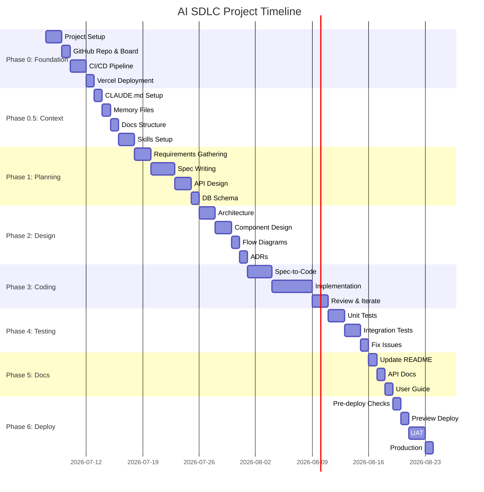

# AI SDLC Activity Timeline

**Project:** Dr-Note (Vibecoding Tour Demo)
**Date:** 2026-07-07
**Status:** Reference Document

> This is a reference document for planning future AI SDLC projects.

---

## Phase Sequence (Mermaid)


---

## Gantt Timeline



---

## Activity Sequence Table

| Order | Phase | Activity | Dependencies | Duration |
|-------|-------|----------|--------------|----------|
| 1 | 0 | Project Setup | — | 2 days |
| 2 | 0 | GitHub Repo & Board | 1 | 1 day |
| 3 | 0 | CI/CD Pipeline | 2 | 2 days |
| 4 | 0 | Vercel Deployment | 3 | 1 day |
| 5 | 0.5 | CLAUDE.md Setup | 4 | 1 day |
| 6 | 0.5 | Memory Files | 5 | 1 day |
| 7 | 0.5 | Docs Structure | 6 | 1 day |
| 8 | 0.5 | Skills Setup | 7 | 2 days |
| 9 | 1 | Requirements Gathering | 8 | 2 days |
| 10 | 1 | Spec Writing | 9 | 3 days |
| 11 | 1 | API Design | 10 | 2 days |
| 12 | 1 | DB Schema | 11 | 1 day |
| 13 | 2 | Architecture | 12 | 2 days |
| 14 | 2 | Component Design | 13 | 2 days |
| 15 | 2 | Flow Diagrams | 14 | 1 day |
| 16 | 2 | ADRs | 15 | 1 day |
| 17 | 3 | Spec-to-Code | 16 | 3 days |
| 18 | 3 | Implementation | 17 | 5 days |
| 19 | 3 | Review & Iterate | 18 | 2 days |
| 20 | 4 | Unit Tests | 19 | 2 days |
| 21 | 4 | Integration Tests | 20 | 2 days |
| 22 | 4 | Fix Issues | 21 | 1 day |
| 23 | 5 | Update README | 22 | 1 day |
| 24 | 5 | API Docs | 23 | 1 day |
| 25 | 5 | User Guide | 24 | 1 day |
| 26 | 6 | Pre-deploy Checks | 25 | 1 day |
| 27 | 6 | Preview Deploy | 26 | 1 day |
| 28 | 6 | UAT | 27 | 2 days |
| 29 | 6 | Production | 28 | 1 day |

**Total Estimated Duration:** ~45 working days (~9 weeks)

---

## Phase Summary

| Phase | Name | Duration | Key Activities |
|-------|------|----------|----------------|
| 0 | Foundation | 1 week | Project setup, GitHub, CI/CD, Vercel |
| 0.5 | Context | 1 week | CLAUDE.md, memory, docs, skills |
| 1 | Planning | 1.5 weeks | Requirements, specs, API, DB schema |
| 2 | Design | 1 week | Architecture, components, diagrams, ADRs |
| 3 | Coding | 2 weeks | Spec-to-code, implementation, review |
| 4 | Testing | 1 week | Unit tests, integration tests, fixes |
| 5 | Docs | 3 days | README, API docs, user guide |
| 6 | Deploy | 1 week | Pre-deploy, preview, UAT, production |

---

## Critical Path

The following activities are **blocking** — if delayed, the entire project slips:

```
Project Setup → CLAUDE.md → Requirements → Spec Writing → Implementation → UAT → Production
```

---

## Parallel Activities

These activities can be done in parallel:

| Parallel Group | Activities |
|----------------|------------|
| Foundation | GitHub Repo + CI/CD Pipeline |
| Context | Memory Files + Docs Structure |
| Planning | API Design + DB Schema |
| Testing | Unit Tests + Integration Tests |
| Docs | README + API Docs |

---

## Risk Factors

| Risk | Impact | Mitigation |
|------|--------|------------|
| AI tool downtime | Delays coding | Have fallback to manual coding |
| Spec changes mid-project | Rework | Lock specs before coding |
| Team unfamiliar with AI tools | Slower start | Training session first |
| Supabase free tier limits | Need upgrade | Monitor usage early |

---

> _Use this timeline as a reference for future AI SDLC projects. Adjust durations based on team size and project complexity._
