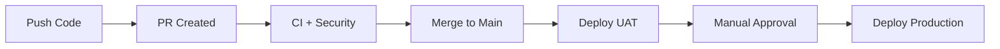
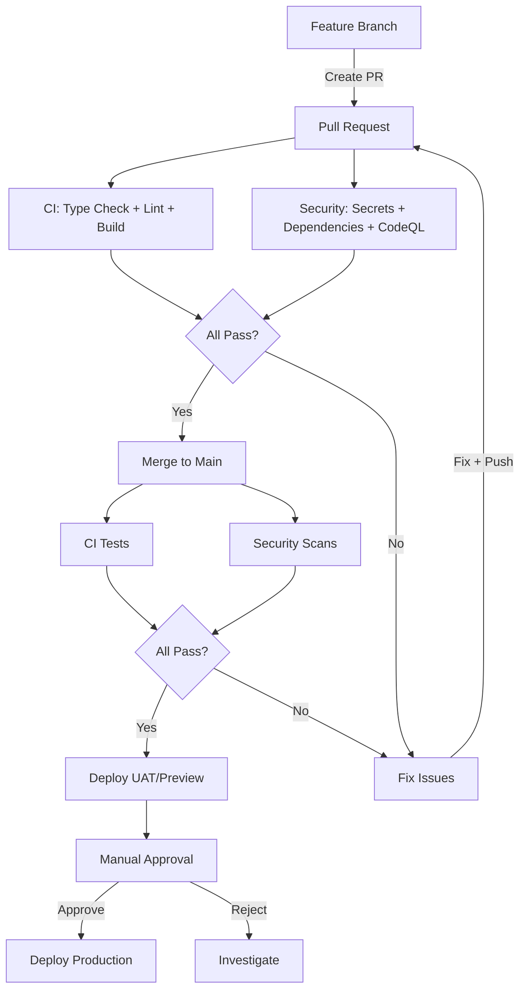

# CI/CD Setup & Workflow Guide

## High-Level Workflow



### Quick Summary

| Step | What Happens | Who |
|------|--------------|-----|
| 1. Push code | Create feature branch + PR | Developer |
| 2. CI runs | Type check, lint, build, security scans | Automated |
| 3. Code review | Review + approve PR | Team |
| 4. Merge | PR merges to main | Developer |
| 5. Deploy UAT | Auto-deploy to preview environment | Automated |
| 6. Approve prod | Review UAT, approve production deploy | Developer/Lead |
| 7. Deploy prod | Auto-deploy to production | Automated |

---

## Detailed Pipeline



### Pipeline Flow Summary

| Stage | Trigger | Action |
|-------|---------|--------|
| PR Created | Feature branch → main | CI + Security checks run |
| PR Merged | Push to main | Deploy pipeline starts |
| UAT Deploy | All checks pass | Auto-deploy to preview |
| Production | UAT deployed | **Manual approval required** |
| Done | Approved | Auto-deploy to production |

---

## 1. Prerequisites

### GitHub Secrets

Go to **Settings → Secrets and variables → Actions** and add:

| Secret | Description | How to get |
|--------|-------------|------------|
| `VERCEL_TOKEN` | Vercel API token | https://vercel.com/account/tokens → Create |
| `VERCEL_ORG_ID` | Vercel org/team ID | Found in `.vercel/repo.json` after `vercel link` |
| `VERCEL_PROJECT_ID` | Vercel project ID | Found in `.vercel/project.json` after `vercel link` |

### Vercel Project Setup

1. Create project at https://vercel.com/new
2. Import your GitHub repo
3. Set **Root Directory** to `app`
4. Add environment variables for **Production** and **Preview**:
   - `NEXT_PUBLIC_SUPABASE_URL`
   - `NEXT_PUBLIC_SUPABASE_ANON_KEY`

### GitHub Environment Protection

1. Go to **Settings → Environments**
2. Create **`production`** environment
3. Add **Required reviewers** (yourself/team)
4. This enables manual approval before production deploys

---

## 2. Workflow Files

### `.github/workflows/deploy.yml` (Main Pipeline)

Triggers on **push to main**. Contains all jobs:

| Job | Purpose | Runs |
|-----|---------|------|
| `test` | Type check, lint, build | Always |
| `secret-scan` | TruffleHog + Gitleaks | Always |
| `dependency-scan` | npm audit + audit-ci | Always |
| `code-scan` | CodeQL analysis | Always |
| `container-scan` | Trivy vulnerability scan | Always |
| `deploy-uat` | Deploy to Vercel preview | After all checks pass |
| `deploy-prod` | Deploy to Vercel production | After UAT + manual approval |

### `.github/workflows/ci.yml` (PR Checks)

Triggers on **pull requests to main**. Runs:
- Type check (`npx tsc --noEmit`)
- Lint (`npm run lint`)
- Build (`npm run build`)

### `.github/workflows/security.yml` (Scheduled + PR Security)

Triggers on **PRs** and **weekly schedule** (Sunday 2am UTC). Runs:
- Secret scanning (TruffleHog + Gitleaks)
- Dependency scanning (npm audit)
- CodeQL analysis
- License checking
- Container scanning (Trivy)

---

## 3. Branch Protection Rules

**Main branch** is protected:

| Rule | Setting |
|------|---------|
| Required status checks | `test`, `secret-scan`, `dependency-scan` |
| Require branches up to date | ✅ Yes |
| Require PR reviews | 1 approval required |
| Dismiss stale reviews | ✅ Yes |
| Allow force pushes | ❌ No |
| Allow deletions | ❌ No |

---

## 4. Deployment Flow

### Step-by-Step

1. **Create feature branch:** `git checkout -b feat/my-feature`
2. **Make changes and commit**
3. **Push and create PR:** CI runs automatically on the PR
4. **Get review + merge:** PR checks must pass
5. **Auto-deploy to UAT (preview):** After merge to main
6. **Approve production:** Click "Review pending deployments" in GitHub Actions
7. **Production deploy:** Automatic after approval

### Environments

| Environment | URL | Auto-deploy | Approval |
|-------------|-----|-------------|----------|
| Preview (UAT) | `https://dr-notes-*.vercel.app` | ✅ Yes | ❌ No |
| Production | `https://dr-notes-nco.vercel.app` | ❌ No | ✅ Required |

---

## 5. Troubleshooting

### "Your project's URL and Key are required"

**Cause:** Supabase env vars missing in Vercel.

**Fix:**
```bash
cd app
npx vercel env add NEXT_PUBLIC_SUPABASE_URL production
# Paste: https://your-project.supabase.co

npx vercel env add NEXT_PUBLIC_SUPABASE_ANON_KEY production
# Paste: your-anon-key
```

Repeat for `preview` environment.

### "Project not found" in CI

**Cause:** `VERCEL_PROJECT_ID` secret is wrong or missing.

**Fix:**
```bash
cd app
cat .vercel/project.json
# Copy the projectId value

gh secret set VERCEL_PROJECT_ID --body "prj_xxxxx"
```

### "Invalid request: 'target' references an environment that does not exist"

**Cause:** Vercel project doesn't have the environment (e.g., `uat`).

**Fix:** Use `preview` instead of `uat` in deploy workflow, or create the environment in Vercel dashboard.

### YAML Syntax Error: "nesting mappings are not allowed"

**Cause:** Windows line endings (CRLF) or unquoted strings in YAML.

**Fix:**
1. Ensure `.gitattributes` exists:
   ```
   *.yml text eol=lf
   *.yaml text eol=lf
   ```
2. Quote all string values:
   ```yaml
   # Bad
   node-version: 24
   
   # Good
   node-version: '24'
   ```
3. Use `env` blocks for expressions:
   ```yaml
   # Bad
   run: deploy --token=${{ secrets.TOKEN }}
   
   # Good
   env:
     TOKEN: ${{ secrets.TOKEN }}
   run: deploy --token=$TOKEN
   ```

### "Incorrect type. Expected 'string'"

**Cause:** Unquoted numeric values in YAML.

**Fix:** Quote all values that should be strings:
```yaml
node-version: '24'      # Not: node-version: 24
cache-dependency-path: 'app/package-lock.json'
```

### 404 on Vercel URL

**Cause:** Wrong Root Directory or project not linked.

**Fix:**
1. Go to Vercel → Settings → General
2. Set **Root Directory** to `app`
3. Redeploy

### 500 INTERNAL_SERVER_ERROR

**Cause:** Runtime error (usually missing env vars).

**Fix:**
1. Check Vercel logs: `npx vercel logs <url>`
2. Verify env vars: `npx vercel env ls`
3. Redeploy after fixing

### Deployment Protection blocking preview URLs

**Cause:** Vercel Authentication enabled.

**Fix:**
1. Go to Vercel → Settings → Deployment Protection
2. Turn off "Vercel Authentication" for Preview deployments

### CI not running on push

**Cause:** Workflow trigger doesn't match branch name.

**Fix:** Ensure branch matches pattern in `deploy.yml`:
```yaml
on:
  push:
    branches: [main]  # Only runs on main
```

### Manual approval not appearing

**Cause:** Production environment has no required reviewers.

**Fix:**
1. Go to GitHub → Settings → Environments → production
2. Add required reviewers

---

## 6. Useful Commands

```bash
# Check Vercel project
cd app && npx vercel project ls

# Link to correct project
cd app && npx vercel link --project dr-notes-nco

# Add env var
cd app && npx vercel env add VAR_NAME environment

# List env vars
cd app && npx vercel env ls

# Pull env vars locally
cd app && npx vercel env pull .env.vercel.local

# Deploy manually
cd app && npx vercel --prod --yes

# Check deployment logs
npx vercel logs <url>

# Check CI status
gh pr checks <pr-number>

# View workflow runs
gh run list --workflow=deploy.yml

# View specific run
gh run view <run-id>
```

---

## 7. File Structure

```
.github/workflows/
├── deploy.yml      # Main pipeline (CI + Security + Deploy)
├── ci.yml          # PR checks only
└── security.yml    # PR + scheduled security scans

.vercel/
├── repo.json       # Vercel project link (gitignored)
└── project.json    # Project ID (gitignored)

app/
├── .env.local          # Local env vars (gitignored)
└── .env.vercel.local   # Vercel env vars (gitignored)
```

---

## 8. Environment Variables Reference

| Variable | Where | Description |
|----------|-------|-------------|
| `VERCEL_TOKEN` | GitHub Secrets | Vercel API token |
| `VERCEL_ORG_ID` | GitHub Secrets | Vercel organization ID |
| `VERCEL_PROJECT_ID` | GitHub Secrets | Vercel project ID |
| `NEXT_PUBLIC_SUPABASE_URL` | Vercel (Production + Preview) | Supabase project URL |
| `NEXT_PUBLIC_SUPABASE_ANON_KEY` | Vercel (Production + Preview) | Supabase anonymous key |
| `SUPABASE_SERVICE_ROLE_KEY` | Vercel (Production + Preview) | Supabase service role key |
