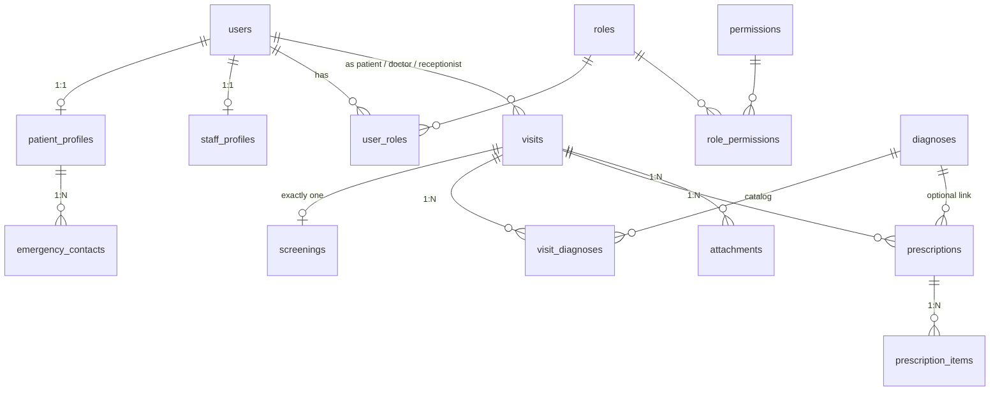

# Doctor's Notes — Design Document

## Overview

A clinical record-keeping app for healthcare workflows: **Admin** manages doctors, **Receptionist** registers patients, **Doctor** creates consultation notes and prescriptions, and **Patient** views their own records.

| Role         | Capabilities                                                        | Cannot                              |
| ------------ | ------------------------------------------------------------------- | ----------------------------------- |
| Admin        | Manage doctors, view dashboards, system settings                    | Create consultations                |
| Receptionist | Register/manage patients, view patient list                         | Create consultations, manage doctors |
| Doctor       | Create consultations, view patient history, export PDF              | Manage doctors, delete patients     |
| Patient      | View own consultations, profile, settings                           | Create or edit any records          |

**Out of scope**: Nurse role, offline mode, clinic/specialist referrals, file attachments (planned for ERD v2).

---

## Tech Stack

| Layer          | Choice                                          | Why                                                 |
| -------------- | ----------------------------------------------- | --------------------------------------------------- |
| Framework      | Next.js 16 (App Router)                         | SSR/RSC, server actions, file-based routing          |
| Frontend       | React 19 + TypeScript                           | Strong typing, server components support             |
| UI Kit         | shadcn/ui (base-nova style)                     | Copy-paste primitives, fully customizable           |
| Styling        | Tailwind CSS v4                                 | Utility-first, design token integration              |
| Icons          | lucide-react                                    | Consistent icon set                                  |
| Backend        | Supabase (BaaS)                                 | Auth, database, RLS, storage in one platform         |
| Database       | PostgreSQL 15+ (hosted on Supabase)             | Relational integrity, RLS policies                   |
| Auth           | Supabase Auth (GoTrue)                          | Managed auth, session refresh, role-based access     |
| Validation     | Zod                                             | Schema-based validation, TypeScript inference        |
| Build/Deploy   | Vercel                                          | Next.js-optimized hosting                            |
| Source Control | GitHub                                          | Spec requirement                                     |

---

## Design System

Based on shadcn/ui (base-nova style). Design components live in `ui-design-demo/ui-design-demo.pen` (Pencil format). 30 screens + 4 role-specific sidebars.

### Theme Tokens

| Token                  | Value                    | Purpose                   |
| ---------------------- | ------------------------ | ------------------------- |
| `--background`         | `hsl(0 0% 100%)`         | Page surface              |
| `--foreground`         | `hsl(222.2 84% 4.9%)`    | Body text                 |
| `--card`               | `hsl(0 0% 100%)`         | Card background           |
| `--card-foreground`    | `hsl(222.2 84% 4.9%)`    | Card text                 |
| `--primary`            | `hsl(222.2 47.4% 11.2%)` | Buttons, active links     |
| `--primary-foreground` | `hsl(210 40% 98%)`       | Text on primary           |
| `--secondary`          | `hsl(210 40% 96.1%)`     | Secondary buttons, hovers |
| `--muted`              | `hsl(210 40% 96.1%)`     | Subtle backgrounds        |
| `--muted-foreground`   | `hsl(215.4 16.3% 46.9%)` | Placeholder text          |
| `--accent`             | `hsl(210 40% 96.1%)`     | Accent highlights         |
| `--destructive`        | `hsl(0 84.2% 60.2%)`     | Delete actions, errors    |
| `--border`             | `hsl(214.3 31.8% 91.4%)` | Borders, dividers         |
| `--input`              | `hsl(214.3 31.8% 91.4%)` | Input field borders       |
| `--ring`               | `hsl(222.2 84% 4.9%)`    | Focus rings               |
| `--radius`             | `0.5rem`                 | Default corner radius     |

Dark theme: add `dark` class to `<html>` — tokens auto-switch via `globals.css`.

### Pencil Design Tokens

| Token               | Value     | Usage                    |
| ------------------- | --------- | ------------------------ |
| `$surface-inverse`  | `#18181B` | Sidebar background       |
| `$foreground-inverse` | `#FAFAFA` | Sidebar text           |
| `$info`             | `#2563EB` | Primary buttons, active states |
| `$destructive`      | `#DC2626` | Delete actions           |

### Component Inventory

| Category         | Components                                             | Used In                             |
| ---------------- | ------------------------------------------------------ | ----------------------------------- |
| **Buttons**      | Default, Large, Secondary, Destructive, Outline, Ghost | Forms, actions, navigation          |
| **Forms**        | Input, Textarea, Select, Switch, Radio Group, Checkbox | All data entry screens              |
| **Data Display** | Card, Badge, Avatar, Table, Data Table                 | Dashboards, detail views            |
| **Navigation**   | Sidebar, Breadcrumb, Tabs, Pagination, Dropdown Menu   | Layout, page navigation             |
| **Feedback**     | Alert, Dialog, Modal, Progress Bar                     | Confirmations, errors, loading      |
| **Layout**       | Accordion, List Item, Icon Button                      | Collapsible sections, compact lists |

---

## Screen Map

Designed in Pencil (`ui-design-demo/ui-design-demo.pen`). 30 screens organized by role.

### Auth

| Screen         | Route              | Layout        | Key Components                                            |
| -------------- | ------------------ | ------------- | --------------------------------------------------------- |
| Login          | `/login`           | Centered card | Card → Input (email), Input (password), Button (Sign in), Link (Forgot password) |
| Forgot Password | `/forgot-password` | Centered card | Card → Input (email), Button (Send reset link), Link (Back to login) |

### Admin

| Screen              | Route                    | Layout            | Key Components                                                              |
| ------------------- | ------------------------ | ----------------- | --------------------------------------------------------------------------- |
| Dashboard           | `/admin`                 | Sidebar + content | Stats cards (doctors, patients, consultations), recent activity             |
| Doctor List         | `/admin/doctors`         | Sidebar + content | Data Table (name, specialization, license), Input (search), Button (Add)    |
| Doctor Registration | `/admin/doctors/new`     | Sidebar + content | Card → Input (name, email, specialization, license, phone), Button (Save)   |
| Doctor Detail       | `/admin/doctors/:id`     | Sidebar + content | Card (doctor info), Button (Edit), Button (Delete)                          |
| Edit Doctor         | `/admin/doctors/:id/edit`| Sidebar + content | Card → Input (pre-filled doctor fields), Button (Save)                      |
| Admin Settings      | `/admin/settings`        | Sidebar + content | Card → Input (name, email), Switch (notifications), Button (Save)           |

### Receptionist

| Screen              | Route                         | Layout            | Key Components                                                              |
| ------------------- | ----------------------------- | ----------------- | --------------------------------------------------------------------------- |
| Dashboard           | `/receptionist`               | Sidebar + content | Stats cards (patients today, pending), recent registrations                 |
| Patient List        | `/receptionist/patients`      | Sidebar + content | Data Table (name, phone, DOB), Input (search), Button (Register)            |
| Patient Registration| `/receptionist/patients/new`  | Sidebar + content | Card → Input (first/last name, DOB, gender, phone, email, address), Button (Save) |
| Patient Detail      | `/receptionist/patients/:id`  | Sidebar + content | Card (patient info), Button (Edit), Button (Delete Patient)                 |
| Receptionist Settings | `/receptionist/settings`    | Sidebar + content | Card → Input (name, email), Switch (notifications), Button (Save)           |

### Doctor

| Screen               | Route                          | Layout            | Key Components                                                              |
| -------------------- | ------------------------------ | ----------------- | --------------------------------------------------------------------------- |
| Dashboard            | `/doctor`                      | Sidebar + content | Stats cards (today's patients, consultations), recent activity              |
| Consultation List    | `/doctor/consultations`        | Sidebar + content | Data Table (patient, date, diagnosis), Input (search), Filter              |
| Consultation Form    | `/doctor/consultations/new`    | Sidebar + content | Card → Select (patient), Input (chief complaint, diagnosis, treatment), Textarea (notes), Input (follow-up date), Button (Save) |
| Consultation Detail  | `/doctor/consultations/:id`    | Sidebar + content | Card (consultation info), Button (Edit), Button (Export PDF)                |
| Doctor Patient Detail| `/doctor/patients/:id`         | Sidebar + content | Card (patient info), Tabs (Consultations \| History), Button (New Consultation) |
| Doctor Settings      | `/doctor/settings`             | Sidebar + content | Card → Input (name, specialization), Switch (notifications), Button (Save)  |

### Patient

| Screen                  | Route                           | Layout            | Key Components                                                              |
| ----------------------- | ------------------------------- | ----------------- | --------------------------------------------------------------------------- |
| Dashboard               | `/patient`                      | Sidebar + content | Stats cards (total consultations, upcoming), recent consultations           |
| My Consultations        | `/patient/consultations`        | Sidebar + content | Data Table (date, doctor, diagnosis), Input (search)                        |
| Patient Consultation Detail | `/patient/consultations/:id` | Sidebar + content | Card (consultation details, doctor notes)                                   |
| Profile                 | `/patient/profile`              | Sidebar + content | Card → Avatar, Input (name, email, phone, DOB), Button (Save)               |
| Patient Settings        | `/patient/settings`             | Sidebar + content | Card → Input (name, email), Switch (notifications), Button (Save)           |

### States & Modals

| Screen              | Description                                          |
| ------------------- | ---------------------------------------------------- |
| Empty State         | Illustration + "No records yet" + CTA button         |
| No Results          | Search illustration + "No results found"              |
| Error State         | Error illustration + message + Retry button           |
| Skeleton Loading    | Pulse-animated placeholder cards/tables              |
| Session Timeout     | Modal → "Session expired" + Login button              |
| Delete Confirmation | Modal → "Are you sure?" + Cancel/Delete buttons       |
| Logout Confirmation | Modal → "Confirm logout?" + Cancel/Logout buttons     |
| Toast Notifications | Success/Error/Info toast messages (bottom-right)     |

### Role-Specific Sidebars

| Role         | Nav Items                                                        |
| ------------ | ---------------------------------------------------------------- |
| Admin        | Dashboard, Patients, Doctors, Consultations, Settings            |
| Receptionist | Dashboard, Patients                                              |
| Doctor       | Dashboard, Patients, Consultations                               |
| Patient      | Dashboard, My Consultations                                      |

---

## Layout

```
┌──────────────────────────────────────────────────────┐
│  Sidebar (240px)          │  Topbar (56px)           │
│  ┌──────────────────┐     │  ┌────────────────────┐  │
│  │ 🏥 Dr. Notes     │     │  │ Breadcrumb    👤 ▾ │  │
│  │                   │     │  └────────────────────┘  │
│  │ 📋 Patients       │     ├──────────────────────────┤
│  │ 🩺 Doctors        │     │                          │
│  │ 💬 Consultations  │     │   Content (max 1200px)   │
│  │                   │     │   ┌──────────────────┐   │
│  │ ─────────────     │     │   │  Card            │   │
│  │ ⚙️ Settings       │     │   │  (page content)  │   │
│  │ 🚪 Logout         │     │   │                  │   │
│  └──────────────────┘     │   └──────────────────┘   │
│                            │                          │
└──────────────────────────────────────────────────────┘
```

- **Sidebar**: 240px, collapsible to 64px (icons only). Role-aware — each role sees different nav items.
- **Topbar**: 56px height. Left: breadcrumb trail. Right: avatar + dropdown (Profile, Settings, Logout).
- **Content**: max-width 1200px, centered with auto margins. Padding 24px. Card-based for forms and detail views.

---

## Data Models

> **Source of truth**: [`docs/guides/01-database-schema.md`](guides/01-database-schema.md) — full column specs, constraints, seed matrix, and migration conventions.

### Schema Overview



### Tables by Zone

#### Identity & Access (blue zone)

| Table | Purpose | Key Relationships |
|-------|---------|-------------------|
| `users` | One row per human (staff or patient). `id` FK → `auth.users(id)` | Supabase Auth owns credentials |
| `staff_profiles` | 1:1 extension for staff (staff_code, department) | PK = `user_id` → users |
| `patient_profiles` | 1:1 extension for patients (NRC, DOB, gender, address) | PK = `user_id` → users |
| `emergency_contacts` | Many per patient (name, relationship, phone) | FK → patient_profiles |
| `roles` | Seed: admin, doctor, nurse, receptionist, patient | 5 roles |
| `permissions` | Verb-style codes (e.g. `patients.create`, `visits.read`) | 10 permission codes |
| `user_roles` | M:N junction — user can hold multiple roles | FK → users, roles |
| `role_permissions` | M:N junction — role → permissions mapping | FK → roles, permissions |

#### Clinical Workflow (teal zone)

| Table | Purpose | Key Relationships |
|-------|---------|-------------------|
| `visits` | **The hub** — everything clinical points here | FK → users (patient, doctor, receptionist) |
| `screenings` | Nurse vitals — exactly one per visit (UNIQUE constraint) | FK → visits |
| `diagnoses` | Read-only ICD catalog (seeded, e.g. I10 Hypertension) | Reference table |
| `visit_diagnoses` | M:N junction — visit → diagnoses, typed (primary/secondary/suspected) | FK → visits, diagnoses |
| `prescriptions` | Prescription header with instruction note | FK → visits, doctors; optional FK → diagnoses |
| `prescription_items` | One row per medicine (name, dosage, frequency, duration, route) | FK → prescriptions |
| `attachments` | File pointers (files in Supabase Storage) | FK → visits |

### Key Decisions

| # | Decision | Ruling |
|---|----------|--------|
| D1 | What do `visits.patient_id` / `doctor_id` / `receptionist_id` reference? | All three → `users.id` (role-correctness via RLS, not FKs) |
| D2 | Where does the diagnostic note live? | `visits.diagnosis_note` (one note per visit) |
| D3 | How many screenings per visit? | Exactly one — `UNIQUE` on `screenings.visit_id` |
| D4 | Do patients log in for v1? | No — patients are `users` rows but get no login UI until after demo |
| D5 | Password storage? | No `password_hash` — Supabase Auth owns credentials |
| D6 | `prescriptions.diagnosis_id` nullability | Nullable — doctor may prescribe without formal catalog diagnosis |

### Authorization (RLS)

All patient/clinical tables have RLS enabled. One helper function resolves permissions:

```sql
CREATE OR REPLACE FUNCTION public.has_permission(perm text)
RETURNS boolean LANGUAGE sql STABLE SECURITY DEFINER SET search_path = public AS $$
  SELECT EXISTS (
    SELECT 1
    FROM user_roles ur
    JOIN role_permissions rp ON rp.role_id = ur.role_id
    JOIN permissions p ON p.id = rp.permission_id
    WHERE ur.user_id = auth.uid() AND p.code = perm
  );
$$;
```

**Rule**: Staff access = permission check; patient access = `= auth.uid()` ownership check. Both, OR-ed, on read policies.

### Permission Matrix

| permission \ role | admin | doctor | nurse | receptionist | patient |
|---|:---:|:---:|:---:|:---:|:---:|
| patients.create | ✅ | | | ✅ | |
| patients.read | ✅ | ✅ | ✅ | ✅ | own only |
| patients.update | ✅ | | | ✅ | |
| visits.create | ✅ | | | ✅ | |
| visits.read | ✅ | ✅ | ✅ | ✅ | own only |
| visits.update_status | ✅ | ✅ | ✅ | ✅ | |
| screenings.create | ✅ | | ✅ | | |
| diagnoses.assign | ✅ | ✅ | | | |
| prescriptions.create | ✅ | ✅ | | | |
| users.manage | ✅ | | | | |

### Deployment Status

| Zone | Tables | Status |
|------|--------|--------|
| Identity & Access | `users`, `roles`, `permissions`, `user_roles`, `role_permissions`, `staff_profiles`, `patient_profiles`, `emergency_contacts` | **Planned** (ERD v2) |
| Clinical Workflow | `visits`, `screenings`, `diagnoses`, `visit_diagnoses`, `prescriptions`, `prescription_items`, `attachments` | **Planned** (ERD v2) |
| Current MVP | `users`, `doctors`, `patients`, `consultations`, `audit_logs` | **Deployed** (migration `00001_initial_schema.sql`) |

> The current MVP uses a simplified 4-table schema. Migration to ERD v2 (14 tables) is planned — see [ERD v2 spec](guides/01-database-schema.md) for full column definitions, seed data, and migration conventions.

---

## API Design

> **Note**: The app uses Supabase client libraries (`@supabase/ssr`, `@supabase/supabase-js`) with Row Level Security. There are no custom REST endpoints — all data access goes through the Supabase client with RLS enforcing permissions. Server Actions (planned) will wrap Supabase calls for form submissions.

### Supabase Client Usage

```typescript
// Browser client (client components)
import { createBrowserClient } from '@supabase/ssr'
const supabase = createBrowserClient()

// Server client (server components, route handlers)
import { createServerClient } from '@supabase/ssr'
// Uses cookies for session management
```

### Auth Flow

```
Register ──→ Supabase Auth signup ──→ Trigger creates users row ──→ Redirect /login
Login    ──→ Supabase Auth login  ──→ Session cookie set         ──→ Redirect by role
Logout   ──→ Supabase Auth logout ──→ Session cookie cleared     ──→ Redirect /login
```

### Data Access Patterns

| Operation        | Client                   | RLS Check                  |
| ---------------- | ------------------------ | -------------------------- |
| List patients    | Browser/Server client    | `is_receptionist()` OR `is_admin()` |
| Create patient   | Server client            | `is_receptionist()` OR `is_admin()` |
| View consultation| Browser/Server client    | Doctor owns it OR `is_admin()` OR `is_receptionist()` |
| Create consultation | Server client         | `is_doctor()`              |
| Manage doctors   | Server client            | `is_admin()`               |

---

## Auth & Authorization

- **Supabase Auth**: Handles signup, login, session management, password reset
- **RLS policies**: Enforce role-based access at the database level
- **Middleware**: Refreshes sessions, redirects unauthenticated users to `/login`
- **Role check helpers**: `is_admin()`, `is_doctor()`, `is_receptionist()` SQL functions
- **Client-side guards**: Route protection based on user role from Supabase session

### Route Protection

| Route Pattern           | Required Role                |
| ----------------------- | ---------------------------- |
| `/admin/*`              | admin                        |
| `/receptionist/*`       | receptionist                 |
| `/doctor/*`             | doctor                       |
| `/patient/*`            | (planned — patients don't login in v1) |
| `/login`, `/forgot-password` | Public (redirect if authenticated) |

---

## Frontend Structure

```
src/
├── app/
│   ├── (auth)/
│   │   ├── login/page.tsx
│   │   └── forgot-password/page.tsx
│   ├── (dashboard)/
│   │   ├── admin/
│   │   │   ├── page.tsx                    # Admin Dashboard
│   │   │   ├── doctors/page.tsx            # Doctor List
│   │   │   ├── doctors/new/page.tsx        # Doctor Registration
│   │   │   ├── doctors/[id]/page.tsx       # Doctor Detail
│   │   │   ├── doctors/[id]/edit/page.tsx  # Edit Doctor
│   │   │   └── settings/page.tsx           # Admin Settings
│   │   ├── receptionist/
│   │   │   ├── page.tsx                    # Receptionist Dashboard
│   │   │   ├── patients/page.tsx           # Patient List
│   │   │   ├── patients/new/page.tsx       # Patient Registration
│   │   │   ├── patients/[id]/page.tsx      # Patient Detail
│   │   │   └── settings/page.tsx           # Receptionist Settings
│   │   ├── doctor/
│   │   │   ├── page.tsx                    # Doctor Dashboard
│   │   │   ├── consultations/page.tsx      # Consultation List
│   │   │   ├── consultations/new/page.tsx  # Consultation Form
│   │   │   ├── consultations/[id]/page.tsx # Consultation Detail
│   │   │   ├── patients/[id]/page.tsx      # Doctor Patient Detail
│   │   │   └── settings/page.tsx           # Doctor Settings
│   │   └── patient/
│   │       ├── page.tsx                    # Patient Dashboard
│   │       ├── consultations/page.tsx      # My Consultations
│   │       ├── consultations/[id]/page.tsx # Consultation Detail
│   │       ├── profile/page.tsx            # Patient Profile
│   │       └── settings/page.tsx           # Patient Settings
│   ├── layout.tsx                          # Root layout (Geist fonts)
│   ├── globals.css                         # Tailwind + theme tokens
│   └── page.tsx                            # Landing/redirect
├── components/
│   ├── ui/                                 # shadcn primitives
│   ├── layout/
│   │   ├── Sidebar.tsx                     # Role-aware collapsible nav
│   │   ├── Topbar.tsx                      # Breadcrumb + avatar dropdown
│   │   └── PageWrapper.tsx                 # Sidebar + Topbar + content slot
│   ├── auth/
│   │   └── SessionTimeout.tsx              # Session expiry warning
│   └── shared/
│       ├── PatientCard.tsx
│       ├── ConsultationTable.tsx
│       └── ConfirmDialog.tsx
├── lib/
│   ├── supabase/
│   │   ├── client.ts                       # Browser Supabase client
│   │   ├── server.ts                       # Server Supabase client
│   │   └── middleware.ts                   # Session refresh logic
│   ├── security.ts                         # requireAuth, requireRole, canAccessPatient
│   ├── rate-limit.ts                       # Upstash Redis rate limiting
│   ├── sanitize.ts                         # Input sanitization
│   ├── audit.ts                            # Audit logging
│   ├── utils.ts                            # cn(), date formatting
│   └── validations/
│       ├── user.ts                         # Registration, login schemas (Zod)
│       ├── patient.ts                      # Patient creation/search schemas
│       └── consultation.ts                 # Consultation + prescription schemas
├── types/
│   └── database.ts                         # Generated Supabase types
├── hooks/                                  # (planned) usePatients, useConsultations, etc.
├── actions/                                # (planned) Server Actions for form submissions
└── middleware.ts                           # Auth redirect middleware
```

### Key Patterns

| Pattern          | Implementation                                                                |
| ---------------- | ----------------------------------------------------------------------------- |
| Route guards     | Middleware redirects unauthenticated users; role checked via Supabase session  |
| Data fetching    | Supabase client with RLS — no custom API layer needed                         |
| Mutations        | Server Actions (planned) wrapping Supabase calls                              |
| Form handling    | Zod schemas for validation (React Hook Form planned)                          |
| Error display    | Toast notifications for API errors; inline field errors for validation        |
| Loading states   | Skeleton components on tables; Button loading state on form submit            |
| Empty states     | Illustration + "No records yet" message + CTA button                          |
| Security         | RLS at DB level, rate limiting via Upstash, input sanitization, audit logging |

---

## Responsive Behavior

| Breakpoint | Sidebar                   | Content                   |
| ---------- | ------------------------- | ------------------------- |
| ≥1024px    | Expanded (240px)          | Full layout               |
| 768–1023px | Collapsed (64px, icons)   | Full width with padding   |
| <768px     | Hidden (hamburger toggle) | Full width, stacked cards |

Mobile: sidebar becomes a slide-over drawer. Tables switch to card-list layout.

---

## Project Status

### Completed
- [x] Supabase project setup (client, server, middleware)
- [x] Database migration (4 tables + audit_logs + RLS)
- [x] Auth middleware (session refresh, role redirect)
- [x] Security libraries (rate limiting, sanitization, audit, RBAC helpers)
- [x] Zod validation schemas
- [x] UI design (30 screens in Pencil)

### In Progress
- [ ] Login page
- [ ] Dashboard pages (per role)
- [ ] CRUD pages (doctors, patients, consultations)

### Planned
- [ ] Server Actions for form submissions
- [ ] PDF export for consultations
- [ ] Patient portal (login for patients)
- [ ] ERD v2 migration (14 tables, RBAC system, screenings, diagnoses catalog)

---

## Open Questions

1. **ERD v2 timeline**: When to migrate from current 4-table schema to the full 14-table ERD v2?
2. **Patient login**: Currently patients are standalone records — when to add patient auth?
3. **Nurse role**: Code references `nurse` role but DB enum doesn't include it — add or remove?
4. **PDF export**: Client-side (`@react-pdf/renderer`) or server-side generation?
