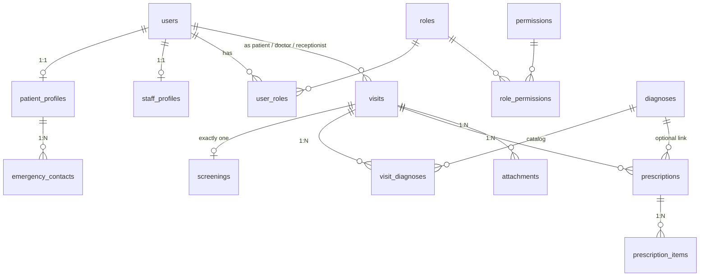

# Dr.Note — Database Schema Architecture (ERD v2)

| | |
|---|---|
| **Author** | Nyan (PM) |
| **Sign-off** | KS + TDM (schema) · AMM (RLS/auth) — *pending* |
| **Status** | `draft v0.1` — becomes binding when sign-off lands |
| **Last updated** | 11 July 2026 |
| **Implements** | Issue [#13](https://github.com/SiThuTun-mdy/Dr-Note/issues/13) (migration) · feeds [#15](https://github.com/SiThuTun-mdy/Dr-Note/issues/15) (seed) · [#17](https://github.com/SiThuTun-mdy/Dr-Note/issues/17) (RLS) |

This is the map for backend and database devs (human or AI agent). If you are writing a migration, a query, or an RLS policy, this document is the source of truth. If reality and this doc disagree, fix one of them — never let them drift silently.

---

## 1. The system in one paragraph

Everyone who can log in is a `users` row. What they may do comes from **one chain only**: `users → user_roles → roles → role_permissions → permissions`. Patients and staff get extra data in 1:1 profile tables. All clinical activity hangs off `visits` — the hub. One visit gets one `screenings` row (vitals), any number of diagnoses via `visit_diagnoses` (picked from the `diagnoses` catalog), prescriptions via `prescriptions` → `prescription_items`, and files via `attachments`. Two notes exist: the **diagnostic note** is a column on `visits`; the **prescription note** is `prescriptions.instruction`. There is no separate notes table in this version.



## 2. Accepted decisions (do not re-litigate in PRs)

| # | Decision | Ruling | Why |
|---|---|---|---|
| D1 | What do `visits.patient_id` / `doctor_id` / `receptionist_id` reference? | All three → `users.id` | Role-correctness enforced by RLS/app checks, not FKs. Fastest to build; one join pattern everywhere. |
| D2 | Where does the diagnostic note live? | `visits.diagnosis_note` (single text column) | One note per visit is enough for the demo. Per-diagnosis notes can be added later on `visit_diagnoses` without breaking anything. |
| D3 | How many screenings per visit? | Exactly one — `UNIQUE` constraint on `screenings.visit_id` | The workflow has one nurse-screening step. The DB should know that, not just the UI. |
| D4 | Do patients log in for the 15 Jul demo? | No. Patients are `users` rows (`is_active = false` is fine) but get no login UI until after the demo | Demo shows 3 staff roles + admin. Patient portal moves to 18 Jul+. Zero schema change either way. |
| D5 | Supabase adaptation: no `password_hash` column | `public.users.id` **references `auth.users.id`**; Supabase Auth owns credentials | The original ERD predates the stack choice. Supabase manages passwords/sessions in its own `auth` schema — never store credentials in public tables. |
| D6 | `prescriptions.diagnosis_id` nullability | Nullable | A doctor may prescribe without a formal catalog diagnosis. |
| — | Postponed tables | `clinical_notes`, `clinical_question_answers` are **out of scope** for the demo migration | Scope cut, 9 July discussion. Do not create them; do not reference them. |

## 3. Conventions

- `snake_case` for everything. Table names plural (`visits`, not `visit`).
- Primary keys: `id uuid default gen_random_uuid()` — except pure junction tables, which use a composite PK, and 1:1 profile tables, which use `user_id` as PK.
- Every table gets `created_at timestamptz not null default now()`.
- Child rows die with their parent: `on delete cascade` from `visits` down.
- Status/type fields are `text` + `CHECK` constraint (not Postgres enums — easier to migrate).
- Migrations live in `supabase/migrations/`, numbered (`00001_initial_schema.sql`), and must run cleanly on a fresh project. Never edit an applied migration — add a new one.

## 4. Table reference

### Identity & access (blue zone)

**`users`** — one row per human, staff or patient.

| column | type | constraints |
|---|---|---|
| id | uuid | PK, **references `auth.users(id)` on delete cascade** (D5) |
| name | text | not null |
| email | text | unique, not null |
| phone | text | |
| is_active | boolean | not null, default true — inactive users cannot log in |
| created_at | timestamptz | not null, default now() |

**`staff_profiles`** — 1:1 extension for staff. Descriptive only — **no role logic here** (ERD v2 fix).

| column | type | constraints |
|---|---|---|
| user_id | uuid | PK, references users(id) on delete cascade |
| staff_code | text | unique, not null (e.g. `DOC001`) |
| department | text | |

**`patient_profiles`** — 1:1 extension for patients.

| column | type | constraints |
|---|---|---|
| user_id | uuid | PK, references users(id) on delete cascade |
| nrc | text | |
| dob | date | |
| gender | text | |
| religion | text | |
| ethnicity | text | |
| address | text | |

**`emergency_contacts`** — many per patient.

| column | type | constraints |
|---|---|---|
| id | uuid | PK |
| patient_id | uuid | not null, references patient_profiles(user_id) on delete cascade |
| name | text | not null |
| relationship | text | |
| phone | text | |

**`roles`** — seed exactly: `admin`, `doctor`, `nurse`, `receptionist`, `patient`.

| column | type | constraints |
|---|---|---|
| id | smallint | PK (stable seeded ids) |
| name | text | unique, not null |

**`permissions`** — verb-style codes, seeded (see §6).

| column | type | constraints |
|---|---|---|
| id | smallint | PK |
| code | text | unique, not null (e.g. `visits.create`) |
| description | text | |

**`user_roles`** — **references `users`, not `staff_profiles`** (ERD v2 fix). A user can hold multiple roles.

| column | type | constraints |
|---|---|---|
| user_id | uuid | references users(id) on delete cascade |
| role_id | smallint | references roles(id) |
| | | PK (user_id, role_id) |

**`role_permissions`**

| column | type | constraints |
|---|---|---|
| role_id | smallint | references roles(id) on delete cascade |
| permission_id | smallint | references permissions(id) |
| | | PK (role_id, permission_id) |

### Clinical workflow (teal zone)

**`visits`** — THE hub. Everything clinical points here.

| column | type | constraints |
|---|---|---|
| id | uuid | PK |
| patient_id | uuid | not null, references users(id) (D1) |
| doctor_id | uuid | **nullable**, references users(id) — may be unassigned at creation |
| receptionist_id | uuid | references users(id) |
| visit_type | text | |
| status | text | not null, default `'waiting'`, CHECK in (`waiting`, `screening`, `with_doctor`, `completed`) |
| chief_complaint | text | |
| diagnosis_note | text | the doctor's diagnostic note (D2) |
| visit_date | timestamptz | not null, default now() |
| created_at | timestamptz | not null, default now() |

**`screenings`** — nurse vitals, exactly one per visit.

| column | type | constraints |
|---|---|---|
| id | uuid | PK |
| visit_id | uuid | not null, **unique** (D3), references visits(id) on delete cascade |
| height_cm | numeric | |
| weight_kg | numeric | |
| bmi | numeric | generated: `weight_kg / (height_cm/100)^2` (or compute in app — either is fine, pick one in the migration) |
| bp_systolic | smallint | |
| bp_diastolic | smallint | |
| heart_rate | smallint | |
| temperature_c | numeric | |
| oxygen_saturation | smallint | percent |
| screened_by | uuid | references users(id) — the nurse |
| created_at | timestamptz | not null, default now() |

**`diagnoses`** — read-only ICD catalog (seeded, not user-editable in the demo).

| column | type | constraints |
|---|---|---|
| id | uuid | PK |
| code | text | unique, not null (e.g. `I10`) |
| title | text | not null (e.g. `Hypertension`) |

**`visit_diagnoses`** — M:N junction, typed.

| column | type | constraints |
|---|---|---|
| id | uuid | PK |
| visit_id | uuid | not null, references visits(id) on delete cascade |
| diagnosis_id | uuid | not null, references diagnoses(id) |
| diagnosis_type | text | not null, CHECK in (`primary`, `secondary`, `suspected`) |
| | | unique (visit_id, diagnosis_id) |

**`prescriptions`** — the header; `instruction` IS the prescription note.

| column | type | constraints |
|---|---|---|
| id | uuid | PK |
| visit_id | uuid | not null, references visits(id) on delete cascade |
| doctor_id | uuid | not null, references users(id) |
| diagnosis_id | uuid | **nullable** (D6), references diagnoses(id) |
| instruction | text | general instruction / prescription note |
| created_at | timestamptz | not null, default now() |

**`prescription_items`** — one row per medicine.

| column | type | constraints |
|---|---|---|
| id | uuid | PK |
| prescription_id | uuid | not null, references prescriptions(id) on delete cascade |
| medicine_name | text | not null |
| dosage | text | e.g. `500mg` |
| frequency | text | e.g. `3/day` |
| duration | text | e.g. `5 days` |
| route | text | e.g. `oral` |
| quantity | smallint | |

**`attachments`** — files live in Supabase Storage; this table stores pointers.

| column | type | constraints |
|---|---|---|
| id | uuid | PK |
| visit_id | uuid | not null, references visits(id) on delete cascade |
| file_path | text | not null (Storage object path, not a public URL) |
| file_type | text | |
| uploaded_by | uuid | references users(id) |
| created_at | timestamptz | not null, default now() |

## 5. Authorization pattern (for #17)

RLS is enabled on every patient/clinical table. All policies resolve through one helper — do not hand-roll per-table role checks:

```sql
create or replace function public.has_permission(perm text)
returns boolean language sql stable security definer set search_path = public as $$
  select exists (
    select 1
    from user_roles ur
    join role_permissions rp on rp.role_id = ur.role_id
    join permissions p on p.id = rp.permission_id
    where ur.user_id = auth.uid() and p.code = perm
  );
$$;
```

Example policy shape (pattern, not final code — #17 owns the real set):

```sql
alter table visits enable row level security;

create policy visits_select on visits for select
  using (has_permission('visits.read') or patient_id = auth.uid());

create policy visits_insert on visits for insert
  with check (has_permission('visits.create'));
```

Rule of thumb: **staff access = permission check; patient access = `= auth.uid()` ownership check.** Both, OR-ed, on read policies of clinical tables.

## 6. Seed matrix (for #15)

Permission codes: `patients.create`, `patients.read`, `patients.update`, `visits.create`, `visits.read`, `visits.update_status`, `screenings.create`, `diagnoses.assign`, `prescriptions.create`, `users.manage`.

| permission \ role | admin | doctor | nurse | receptionist | patient |
|---|---|---|---|---|---|
| patients.create | ✅ | | | ✅ | |
| patients.read | ✅ | ✅ | ✅ | ✅ | own only (RLS) |
| patients.update | ✅ | | | ✅ | |
| visits.create | ✅ | | | ✅ | |
| visits.read | ✅ | ✅ | ✅ | ✅ (no clinical detail) | own only (RLS) |
| visits.update_status | ✅ | ✅ | ✅ | ✅ | |
| screenings.create | ✅ | | ✅ | | |
| diagnoses.assign | ✅ | ✅ | | | |
| prescriptions.create | ✅ | ✅ | | | |
| users.manage | ✅ | | | | |

Seed also: the 5 roles, the ICD starter catalog (I10 Hypertension, E11 Type 2 Diabetes, J11 Influenza, + ~10 common codes), demo users (1 admin, 1 doctor, 1 nurse, 1 receptionist, 3 patients) — **all fictional data, no real NRC/names/phones** (see issue #42).

## 7. The workflow, end to end (read this if you're new)

1. **Receptionist** registers a patient → `users` + `patient_profiles` (+ `emergency_contacts`).
2. Receptionist opens a **visit** → status `waiting`, chief complaint recorded, doctor optional.
3. **Nurse** takes vitals → one `screenings` row, status → `screening` → `with_doctor`.
4. **Doctor** consults: picks diagnoses from the catalog (`visit_diagnoses`, typed primary/secondary/suspected), writes `visits.diagnosis_note`.
5. Doctor prescribes → `prescriptions` (+ `instruction` note) with N `prescription_items`.
6. Files (X-ray, lab PDF) → `attachments`.
7. Status → `completed`. History views read visits (+ children) filtered by RLS.

## 8. Changelog

- **v0.1 (11 Jul 2026)** — first draft from ERD v2: `user_roles` re-pointed to `users`; role link removed from `staff_profiles`; `clinical_notes` + `clinical_question_answers` postponed; `diagnosis_note` added to `visits`; decisions D1–D6 recorded.