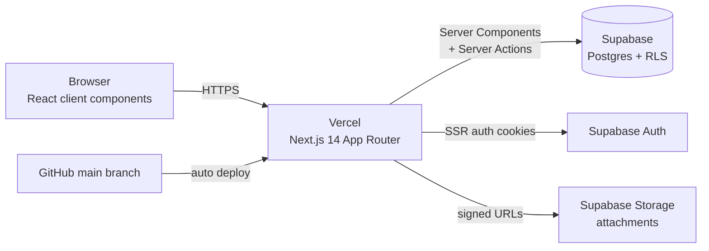

# Dr.Note — Architecture Guide

| | |
|---|---|
| **Author** | Nyan (PM) |
| **Sign-off** | NCO (infra/architecture) · STT (frontend patterns) — *pending* |
| **Status** | `draft v0.1` — becomes binding when sign-off lands |
| **Last updated** | 11 July 2026 |
| **Related** | [01-database-schema.md](01-database-schema.md) (data model) · NCO's ADR log in `docs/adr/` (decision records) |

The map for anyone (human or AI agent) writing application code. Feature specs are **not** in this file — they live in GitHub issues, written against the template in §9. This doc is the *constraints* those specs assume.

> **Note on the RFC branch:** several patterns below match proposals in `feat/auth-middleware`. Sign-off review should confirm each match, and accepted decisions get mirrored as ADRs by NCO.

---

## 1. System overview



One Next.js app does everything — there is no separate backend service. Supabase is the backend: Postgres (with RLS as the real security boundary), Auth, and Storage. Vercel builds from `main`.

## 2. Stack (decided in PRD, 6 July — not open for debate)

| Layer | Choice | Rule of use |
|---|---|---|
| Framework | Next.js 14, **App Router**, TypeScript strict | Server Components by default; `"use client"` only when interaction demands it |
| Styling | Tailwind + shadcn/ui | shadcn components only — no other UI libraries, no custom CSS files |
| Server state | React Query | Client-side reads that need caching/refetching (e.g. live queue) |
| UI state | Zustand | UI-only state (modals, filters). **Never** put server data in Zustand |
| Forms | React Hook Form + Zod | One Zod schema per form, reused for server-side validation |
| DB/Auth/Files | Supabase | Access via helpers in `src/lib/supabase/` only — never instantiate clients ad hoc |
| Hosting | Vercel | `main` → production; every PR → preview deployment |

## 3. Data access pattern (the most important section)

- **Reads:** Server Components call the **server** Supabase client directly. Client components that need live data use React Query wrapping the **browser** client.
- **Writes:** **Server Actions** — not API route handlers. One action per mutation, in `actions.ts` next to the route that owns it. Validate input with the form's Zod schema *inside* the action.
- **Never** call Supabase from a client component for writes.
- **RLS is the security boundary.** UI hiding (nav, buttons) is UX, not security. Every table policy per [01-database-schema.md §5](01-database-schema.md). Assume any client request can be forged; the DB must still say no.
- The **service-role key** is forbidden in application code. If a job truly needs it (seeding), it runs as a script, never in the deployed app.

## 4. Auth flow

1. Login page → Supabase Auth (email/password), SSR cookie session (`@supabase/ssr`).
2. `src/middleware.ts` refreshes the session on every request and redirects unauthenticated users to `/login`.
3. After login, fetch the user's roles once (chain in 01 §5) and route to the role's dashboard.
4. Route groups guard by role (layout-level check + redirect). RLS backs it up at the data layer.
5. Demo scope (D4): patients do not log in until after 15 Jul.

## 5. Folder structure

```
src/
  app/
    (auth)/login/          # public: landing + login
    (dashboard)/           # authed shell: sidebar, topbar
      admin/               # role-scoped route groups
      doctor/
      nurse/
      reception/
    layout.tsx
  components/
    ui/                    # shadcn primitives (generated — don't hand-edit)
    features/<feature>/    # feature components (visit-form/, screening/, ...)
  lib/
    supabase/              # client.ts, server.ts, middleware.ts helpers
    validators/            # Zod schemas, shared client + server
    utils.ts
  types/
    database.ts            # generated from Supabase — never hand-edit
supabase/
  migrations/              # numbered SQL, append-only
  seed.sql
docs/guides/               # PM-authored guides (this doc)
docs/adr/                  # NCO's decision log
```

Placement rule: code used by one feature lives in that feature's folder; promote to `lib/`/`components/ui` only on second use.

## 6. Environments & secrets

| Env | Where | Notes |
|---|---|---|
| `NEXT_PUBLIC_SUPABASE_URL` / `NEXT_PUBLIC_SUPABASE_ANON_KEY` | `.env.local`, Vercel | Safe for client — RLS does the guarding |
| `SUPABASE_SERVICE_ROLE_KEY` | Local scripts only | **Never** in Vercel app env, never in client bundles (issue #42 verifies) |

`.env.example` stays current; `.env*` is gitignored. One shared Supabase project for the demo (no separate staging — accepted risk for an 8-day sprint).

## 7. CI/CD & branch strategy

- `main` is protected: PRs only, review required (STT owns PR review), squash merge.
- Branches: `feat/<issue>-<slug>`, `fix/<issue>-<slug>`, `docs/<slug>`. Reference the issue in the PR (`Closes #26`).
- GitHub Actions on every PR: lint, typecheck, build (issue #14). Red pipeline = no merge, no exceptions during demo week.
- Vercel: PR previews for review; `main` deploys production (issue #40 hardens this).

## 8. Testing bar (demo-week pragmatism)

- Every task's acceptance criteria verified on the **preview deployment** before merge — not just localhost.
- One Playwright E2E happy path (issue #30) once the core flow exists.
- Manual test checklist (issue #29) runs against production before each demo.
- No unit-test coverage requirement this sprint — acceptance criteria are the bar.

## 9. Feature specs = GitHub issues (the agent-brief template)

There is no feature-specs document. Each task issue **is** the spec, written so a teammate's AI agent can execute it without this conversation's context. Required sections:

```markdown
Part of #<epic>

## Story
As a <role>, I want <capability> so that <outcome>.

## Context
What already exists: relevant tables (link 01-database-schema.md section),
routes, components, prior issues. Assume the reader knows nothing.

## Constraints
- Patterns from 02-architecture.md that apply (data access §3, auth §4, folders §5)
- Permission codes involved (01 §6)

## Files
Likely touch points: src/app/..., src/lib/validators/..., supabase/migrations/...

## Acceptance criteria
- [ ] Testable yes/no statements only

## Done means
Lint + typecheck green · verified on preview deployment · PR references this issue
```

Rules: one issue = one PR = one owner. An issue needing two PRs is two issues. An acceptance criterion you can't verify by clicking or running a test is an opinion — rewrite it.

## 10. Changelog

- **v0.1 (11 Jul 2026)** — first draft: stack rules, server-actions data access, SSR auth flow, folder structure, env/secrets policy, CI/CD gates, agent-brief template.
